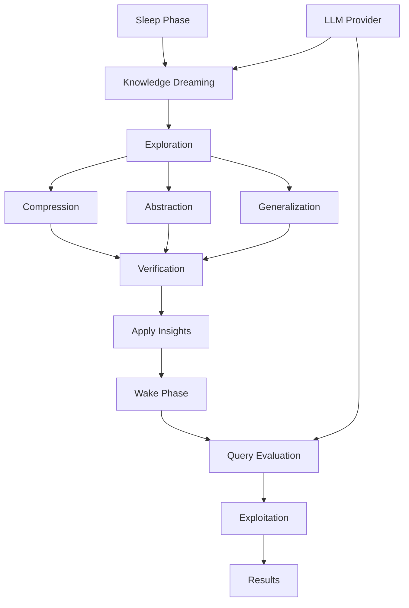

# DreamLog: Logic Programming with Wake-Sleep Cycles

<div align="center">

**A reasoning engine that dreams to improve itself, inspired by how the brain consolidates knowledge during sleep.**

[](https://python.org)
[](LICENSE)
[](https://yourdocs.com)

</div>

## What is DreamLog?

DreamLog is a revolutionary logic programming language that implements **wake-sleep cycles** for continuous self-improvement. Like the human brain consolidating memories during REM sleep, DreamLog alternates between:

- 🌞 **Wake Phase (Exploitation)**: Efficiently answers queries using existing knowledge
- 🌙 **Sleep Phase (Exploration)**: Dreams up new abstractions, compressions, and generalizations

Inspired by **DreamCoder** and neuroscience, DreamLog discovers general principles through compression—following the insight that simpler explanations covering more cases are likely more true.

## The Wake-Sleep Paradigm

### Traditional Logic Programming
```prolog
% Static knowledge base - never improves
parent(john, mary).
parent(mary, alice).
grandparent(X, Z) :- parent(X, Y), parent(Y, Z).
% Knowledge remains fixed, redundant, and potentially inconsistent
```

### DreamLog's Approach
```python
from dreamlog.pythonic import dreamlog
from dreamlog.kb_dreamer import KnowledgeBaseDreamer

# Wake phase: Use knowledge
kb = dreamlog(llm_provider="openai")
kb.fact("parent", "john", "mary")
kb.fact("parent", "mary", "alice")
results = kb.query("grandparent", "john", "X")

# Sleep phase: Dream to optimize
dreamer = KnowledgeBaseDreamer(kb.provider)
session = dreamer.dream(
    kb, 
    dream_cycles=3,           # Multiple REM cycles
    exploration_samples=10,    # Explore different optimizations
    verify=True               # Ensure behavior preservation
)

print(f"Compression achieved: {session.compression_ratio:.1%}")
print(f"Generalization score: {session.generalization_score:.2f}")

# Wake with improved knowledge
if session.verification.similarity_score > 0.95:
    kb = dreamer.apply_insights(kb, session.insights)
```

## Key Innovations

### 🧠 Compression as Intelligence
Following Occam's Razor and information theory: **simpler explanations that cover more cases are better**. DreamLog automatically:
- Merges similar rules into general patterns
- Abstracts specific facts into higher-level concepts
- Decomposes complex rules into reusable components

### 🔄 Exploration vs Exploitation
- **Exploitation**: Fast query answering with current knowledge
- **Exploration**: Sample multiple reorganization paths during sleep
- **Verification**: Ensure optimizations preserve (or improve) behavior

### 🤖 LLM-Powered Reasoning
When encountering undefined predicates:
1. Context-aware knowledge generation
2. Consistency with existing facts/rules
3. Automatic integration into knowledge base

## Core Features

### 🎯 Fluent Python API
```python
kb = dreamlog()
kb.fact("likes", "alice", "bob") \
  .fact("likes", "bob", "charlie") \
  .rule("friends", ["X", "Y"]) \
  .when("likes", ["X", "Y"]) \
  .and_("likes", ["Y", "X"]) \
  .build()

# Query with Pythonic iteration
for result in kb.query("friends", "X", "Y"):
    print(f"{result['X']} and {result['Y']} are friends")
```

### 🌙 Knowledge Dreaming
```python
# Automatic optimization during sleep
session = kb.dream(
    focus="compression",      # Or "abstraction", "decomposition", "all"
    exploration_samples=5,    # Try multiple paths
    verify=True              # Verify behavior preservation
)

# See what was discovered
for insight in session.insights:
    print(f"{insight.type}: {insight.description}")
    print(f"  Compression: {insight.compression_ratio:.1f}x")
    print(f"  Coverage gain: {insight.coverage_gain:.1f}x")
```

### 🔬 Behavior Verification
```python
# Ensure optimizations don't break existing behavior
verification = session.verification
print(f"Behavior preserved: {verification.preserved}")
print(f"Similarity score: {verification.similarity_score:.2%}")

# Some changes might be improvements!
for improvement in verification.improvements:
    print(f"Improvement found: {improvement}")
```

### 🧪 Multiple Exploration Paths
```python
# Like DreamCoder, explore different optimization strategies
insights = kb.explore_optimizations(
    samples=10,              # Number of different paths
    temperature_range=(0.5, 1.0),  # Creativity range
    strategies=["compress", "abstract", "generalize"]
)
```

## Use Cases

### 🧠 Cognitive Modeling
Model how humans consolidate and abstract knowledge during sleep

### 🔬 Scientific Discovery
Automatically discover general principles from specific observations

### 🎓 Adaptive Education
Systems that reorganize knowledge based on student interactions

### 🏗️ Self-Improving AI
Build systems that get better through use, not just more training

### 📊 Knowledge Graph Optimization
Compress and reorganize large knowledge bases for efficiency

## Architecture



## Configuration

### Enable Dreaming
```yaml
# ~/.dreamlog/config.yaml
provider:
  provider: openai
  model: gpt-4
  temperature: 0.7

sampling:
  max_facts: 20
  max_rules: 15
  strategy: related  # Sample related knowledge for context

dreaming:
  auto_dream: true
  dream_interval: 100  # Dream after every 100 queries
  min_compression_ratio: 0.2  # Only apply if 20% compression achieved
  verification_threshold: 0.95  # Require 95% behavior preservation
```

## Getting Started

```bash
# Install DreamLog
pip install dreamlog

# Start interactive REPL
python -m dreamlog.repl

# Enable wake-sleep cycles
python -m dreamlog.repl --enable-dreaming

# Run with LLM support
export OPENAI_API_KEY=your-key
python -m dreamlog.repl --llm --enable-dreaming
```

## The Philosophy

DreamLog embodies the principle that **intelligence emerges from the interplay of exploration and exploitation**. Like the brain during sleep:

1. **Consolidation**: Strengthen important patterns
2. **Abstraction**: Find general principles
3. **Compression**: Achieve more with less
4. **Creativity**: Explore novel reorganizations

This isn't just logic programming with LLMs bolted on—it's a fundamentally new paradigm where **the system's knowledge representation evolves through use**.

## Community

- 📖 [Documentation](https://docs.dreamlog.dev)
- 🐛 [Issue Tracker](https://github.com/queelius/dreamlog/issues)
- 💬 [Discussions](https://github.com/queelius/dreamlog/discussions)
- 🤝 [Contributing Guide](contributing.md)

## License

MIT License - see [LICENSE](LICENSE) for details.

---

<div align="center">
<i>Built by dreamers who believe reasoning systems should sleep, perchance to dream</i>
</div>